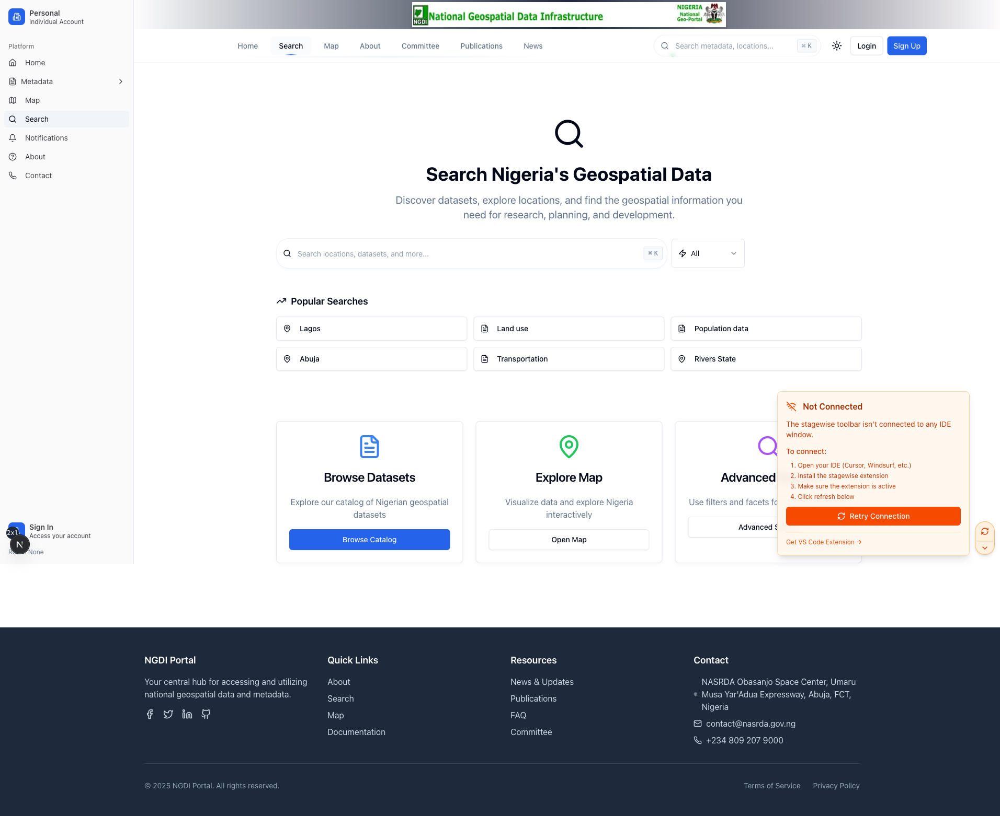
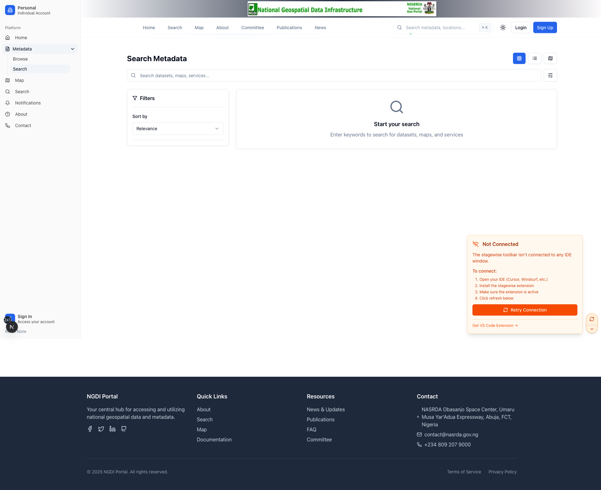

# NGDI Metadata Portal: A Strategic Implementation Proposal for Nigeria's Digital Future

**Total Projected Investment: ₦231,000,000 (Two Hundred and Thirty-One Million Naira)**
**Date: July 12, 2025**
**Version: 2.0**

---

## Executive Summary

### The Challenge

Nigeria's vast and valuable geospatial data assets—critical for everything from national security to economic planning—are currently decentralized and fragmented across numerous government agencies. This lack of a unified access point creates significant operational inefficiencies, results in costly data duplication, hampers data-driven decision-making, and limits our ability to address critical national challenges. The absence of a central portal means that planners, security forces, and innovators are often working with incomplete, outdated, or inaccessible information.

### The Solution

This proposal outlines the implementation of the National Geospatial Data Infrastructure (NGDI) Metadata Portal—a secure, centralized, and high-performance digital platform. The portal will serve as the definitive national hub for discovering, accessing, and utilizing geospatial metadata, empowering a wide range of stakeholders, from federal ministries and state agencies to private sector innovators and academic researchers. It will transform our fragmented data landscape into a cohesive, searchable, and actionable national asset.

### The Strategy

We propose a strategic hybrid infrastructure model, combining a sovereign, on-premise data center for core data security and performance with the scalability and resilience of enterprise cloud services. This approach is not a compromise but a deliberate strategy to guarantee data sovereignty, optimize performance for Nigerian users, and ensure long-term cost-effectiveness, providing the best of both worlds.

### The Investment

With a total projected investment of ₦231 million, which includes a prudent 10% contingency fund, this project represents a foundational investment in Nigeria's digital transformation. It aligns directly with the National Digital Economy Policy and Strategy (NDEPS). The outcome will be a robust, enterprise-grade solution that delivers immediate value and positions Nigeria as a leader in geospatial data management and digital governance in Africa.

---

## 1. Strategic Rationale & Project Justification

### 1.1 The Case for a National Metadata Portal

A centralized metadata portal is an essential component of modern digital governance. The NGDI Portal will directly address several key national priorities with tangible benefits:

**Enhanced National Security**: By providing a common operational picture, the portal will empower defense, intelligence, and law enforcement agencies with timely access to integrated geospatial data for border monitoring, counter-terrorism operations, maritime security, and internal security planning.

**Informed Policy & Planning**: It will equip ministries with the data needed for effective urban and regional planning, natural resource management, climate change adaptation, and critical infrastructure development. For example, the Ministry of Works and Housing can use it to plan new road networks, avoiding environmental hazards identified by the Ministry of Environment.

**Economic Growth and Innovation**: The portal will serve as a catalyst for economic growth by providing the private sector with reliable data for innovation in GIS-based industries, precision agriculture, logistics and supply chain optimization, real estate, and financial services.

**Efficient Disaster Management**: In times of crisis, such as flooding or public health emergencies, the portal will facilitate rapid access to critical data for emergency response coordination, damage assessment, and long-term mitigation planning by agencies like NEMA.

### 1.2 Justification for a Hybrid Deployment Model

A hybrid infrastructure is the optimal strategy for this project, providing an unparalleled balance of security, control, performance, and flexibility.

**Data Sovereignty and National Security**: An on-premise primary data center is non-negotiable for ensuring that all sensitive and sovereign geospatial metadata remains within Nigeria's physical and legal jurisdiction. This is paramount for national security and for complying with the Nigerian Data Protection Act and other regulatory frameworks, preventing foreign government access and ensuring data cannot be moved or deleted without national consent.

**Control and Performance**: Hosting the core database and primary applications on-premise guarantees maximum control over the environment and provides high-speed, low-latency access for critical government operations and local users. This ensures that queries for large datasets are returned in seconds, not minutes, which is crucial for time-sensitive decision-making.

**Resilience and Global Accessibility**: Leveraging enterprise cloud services provides a robust, geographically distributed, and cost-effective disaster recovery solution. It also allows for the elastic scaling of public-facing components, the use of Content Delivery Networks (CDNs) to provide fast access to international users and researchers, and integration with specialized third-party services without the need for major capital investment in additional hardware.

**Long-Term Cost Optimization and Modernization**: This model allows for placing workloads in the most cost-effective environment. While requiring an initial capital outlay, the on-premise infrastructure for core, predictable workloads offers a lower Total Cost of Ownership (TCO) over the long term compared to a purely cloud-based model, which can have unpredictable and escalating operational costs. The cloud component allows for continuous modernization by adopting new services as they become available.

---

## 2. System Architecture & Technical Specifications

### 2.1 Core Technology Stack

The technology stack has been selected to ensure performance, scalability, and maintainability:

- **Frontend**: Next.js 15 with TypeScript, Tailwind CSS, Shadcn UI - Chosen for its high-performance server-side rendering (SSR), static site generation (SSG), strong typing for fewer errors, and modern, accessible UI components.

- **Backend**: PostgreSQL database with Drizzle ORM - PostgreSQL is a powerful, open-source object-relational database system with strong support for geospatial data via the PostGIS extension. Drizzle ORM provides a type-safe and efficient way to interact with the database.

- **Authentication**: Clerk Enterprise Authentication - Provides a secure, scalable, and feature-rich solution for user management, including multi-factor authentication (MFA) and role-based access control (RBAC).

- **Analytics**: PostHog Enterprise Analytics - An open-source analytics platform that can be self-hosted to maintain data privacy while providing deep insights into user behavior and application performance.

- **Mapping**: Leaflet & MapLibre GL JS with enterprise mapping services - A combination of powerful, open-source mapping libraries that provide flexibility for displaying various map layers and data visualizations.

- **GIS Integration**: ArcGIS REST API, OGC WMS/WFS services - Ensures seamless interoperability with existing GIS systems across government agencies, supporting open standards for broad compatibility.

### 2.2 Key Features

- Comprehensive metadata management system
- Advanced search and discovery capabilities
- Role-based access control (RBAC)
- Interactive mapping and visualization
- Organization and user management
- Admin dashboard and monitoring
- API access for programmatic integration
- Multi-organizational support

---

## 3. On-Premise Hardware Infrastructure - ₦85,000,000

This investment covers the physical backbone of the project, ensuring high availability, business continuity, and data security.

### 3.1 Primary Data Center (₦45,000,000)

#### 3.1.1 Core Servers (₦25,000,000)

High-performance Dell PowerEdge servers for hosting applications and the core PostgreSQL database. This includes dedicated servers for web, application, and database tiers to ensure workload isolation and performance.

- **Application Servers (4 units)**: ₦12,000,000
  - Dell PowerEdge R750 or equivalent
  - 2x Intel Xeon Silver 4314 processors
  - 128GB DDR4 RAM
  - 2x 960GB SSD (OS) + 4x 1.92TB SSD (Data)
  - Redundant power supplies

- **Database Servers (2 units)**: ₦8,000,000
  - Dell PowerEdge R750 or equivalent
  - 2x Intel Xeon Gold 6338 processors
  - 256GB DDR4 RAM
  - 2x 960GB SSD (OS) + 8x 3.84TB SSD (Data)
  - Hardware RAID controller

- **Storage Array**: ₦5,000,000
  - Dell PowerVault ME5024 or equivalent
  - 24x 7.68TB SSD drives
  - Dual controllers with 32GB cache each
  - 10GbE and 25GbE connectivity

#### 3.1.2 Network Infrastructure (₦12,000,000)

A redundant, high-speed network built on Cisco Catalyst switches and protected by Fortinet firewalls with Intrusion Detection/Prevention Systems (IDS/IPS) for robust security.

- **Core Network Switch**: ₦4,000,000
  - Cisco Catalyst 9500 48-port or equivalent
  - 48x 10GbE ports + 8x 40GbE uplinks
  - Redundant power and cooling

- **Access Switches (4 units)**: ₦3,000,000
  - Cisco Catalyst 9300 24-port switches
  - 24x 1GbE ports + 4x 10GbE uplinks

- **Firewalls & Security Appliances**: ₦5,000,000
  - Primary: Fortinet FortiGate 600F or equivalent
  - Secondary: Fortinet FortiGate 400F (failover)
  - Intrusion Detection/Prevention System

#### 3.1.3 Power & Cooling (₦25,000,000)

A robust, hybrid power system designed for maximum uptime, sustainability, and grid independence. This system combines solar energy, battery storage, inverter technology, industrial generator backup, and precision cooling to ensure continuous operation of the data center regardless of grid conditions.

- **Solar Panel Array & Installation**: ₦10,000,000
  - 50kW solar PV system (Tier-1 panels)
  - Hybrid inverter (50kVA), charge controllers, mounting, cabling
  - Professional installation and commissioning

- **Battery Bank (Lithium, Scalable)**: ₦5,000,000
  - 48V lithium battery bank (minimum 200kWh usable)
  - Battery management system (BMS)

- **Industrial Generator (Diesel, 100kVA)**: ₦5,000,000
  - Soundproofed, automatic transfer switch (ATS)
  - 1,000L fuel tank, installation

- **UPS System**: ₦2,000,000
  - APC Smart-UPS VT 40kVA (primary only, for instant switchover)
  - Battery backup for 10 minutes (bridges to solar/battery/generator)

- **Precision Cooling Systems**: ₦3,000,000
  - Precision air conditioning units
  - Redundant cooling with N+1 configuration
  - Environmental monitoring

### 3.2 Disaster Recovery Site (₦22,000,000)

A fully equipped secondary site, geographically separate from the primary data center. It will house replica servers, storage, and network infrastructure. In the event of a primary site failure, operations can be failed over to the DR site within minutes, ensuring minimal disruption to service.

#### 3.2.1 DR Servers (₦12,000,000)

- **Application Servers (2 units)**: ₦5,000,000
- **Database Server (1 unit)**: ₦3,000,000
- **Storage Array**: ₦4,000,000

#### 3.2.2 DR Network & Infrastructure (₦10,000,000)

- Network equipment and connectivity
- Power and cooling systems
- Security appliances

### 3.3 Monitoring & Management (₦13,000,000)

#### 3.3.1 Monitoring Systems (₦7,000,000)

A suite of enterprise-grade tools for comprehensive, real-time monitoring of all infrastructure components:

- **Network Monitoring**: Open-source (e.g., Zabbix, Prometheus)
- **Server Monitoring**: PRTG or equivalent
- **Application Performance Monitoring**: New Relic (phased)
- **Log Management**: Open-source (e.g., ELK stack)

#### 3.3.2 Backup Systems (₦6,000,000)

Veeam backup and replication systems for robust, automated data protection, with regular testing of backup integrity and recovery procedures:

- **Backup Appliances**: Veeam Backup & Replication
- **Tape Libraries**: For long-term archival
- **Cloud Backup**: Secondary backup to cloud

---

## 4. Software, Cloud & Professional Services

### 4.1 Software Licensing - ₦40,000,000

Covers all necessary enterprise licenses for operating systems, virtualization, databases, security suites, and development tools. Cost optimization achieved by negotiating volume discounts, leveraging open-source alternatives, and phasing some non-critical licenses.

#### 4.1.1 Operating Systems & Virtualization - ₦10,000,000

- **Windows Server 2022 Datacenter**: ₦2,000,000
- **VMware vSphere Enterprise Plus**: ₦5,000,000
- **Red Hat Enterprise Linux**: ₦3,000,000

#### 4.1.2 Database Systems - ₦12,000,000

- **PostgreSQL Enterprise**: ₦6,000,000
- **Database Monitoring Tools**: ₦3,000,000
- **Database Backup Solutions**: ₦3,000,000

#### 4.1.3 Web & Application Services - ₦7,000,000

- **Enterprise Web Server Licenses**: ₦1,500,000
- **Load Balancer Software**: ₦2,500,000
- **SSL Certificates**: ₦500,000
- **CDN Services**: ₦2,500,000

#### 4.1.4 Security Software - ₦6,000,000

- **Antivirus & Anti-malware**: ₦2,000,000
- **Vulnerability Management**: ₦2,000,000
- **SIEM Solution**: ₦2,000,000

#### 4.1.5 Development & GIS Tools - ₦2,000,000

- **ArcGIS Enterprise**: ₦1,500,000
- **Development Tools**: ₦500,000

### 4.2 Cloud Services & Hosting - ₦20,000,000

Optimized by focusing on essential workloads, leveraging reserved instances, and deferring some non-critical cloud services to later phases.

#### 4.2.1 Primary Cloud Infrastructure - ₦12,000,000

- **Cloud Hosting Services**: ₦7,000,000
- **Cloud Database Services**: ₦3,000,000
- **Cloud Storage**: ₦2,000,000

#### 4.2.2 Third-Party Services - ₦8,000,000

- **Clerk Authentication (Enterprise)**: ₦2,000,000
- **PostHog Analytics (Enterprise)**: ₦1,500,000
- **MapTiler/Mapping Services**: ₦1,500,000
- **Email Services**: ₦1,000,000
- **External API Services**: ₦2,000,000

### 4.3 Professional Services & Implementation - ₦30,000,000

Streamlined by using local talent, optimizing project management, and phasing some consulting services.

#### 4.3.1 System Implementation - ₦16,000,000

- **Project Management & System Design**: ₦10,000,000
- **Infrastructure Setup**: ₦6,000,000

#### 4.3.2 Software Development & Customization - ₦14,000,000

- **Application Development**: ₦9,000,000
- **Testing & Quality Assurance**: ₦3,000,000
- **Performance Optimization**: ₦2,000,000

---

## 5. Governance, Training & Support

### 5.1 Governance and Stakeholder Engagement

A multi-agency NGDI Governance Committee will be established to oversee data standards, contribution policies, and stakeholder collaboration. This committee will include representatives from key stakeholders such as the Office of the Surveyor General, Ministry of Defence, Ministry of Agriculture, and other relevant bodies to ensure the portal meets the diverse needs of all users.

### 5.2 Training & Documentation - ₦7,000,000

A comprehensive, multi-tiered training program will be developed to drive adoption and ensure proficient use of the platform. This includes the creation of detailed technical manuals, user guides, and video tutorials for different user roles:

#### 5.2.1 User Training - ₦4,000,000

- **Administrator Training**: ₦1,500,000
  - In-depth technical training for IT staff on system maintenance, monitoring, and security
- **Data Contributor Training**: ₦1,500,000
  - For agency officers on how to prepare, validate, and upload metadata
- **End-User Training**: ₦1,000,000
  - For policy analysts, researchers, and the public on effective search and data utilization

#### 5.2.2 Documentation - ₦3,000,000

- **Technical Documentation**: ₦1,500,000
  - System architecture and maintenance guides
- **User Manuals**: ₦1,000,000
  - Comprehensive user documentation
- **Training Materials**: ₦500,000
  - Training videos and materials

### 5.3 Domain & Digital Infrastructure - ₦2,000,000

#### 5.3.1 Domain Registration & Management - ₦500,000

- **Primary Domain**: ngdi.gov.ng
- **Alternative Domains**: Various TLDs for protection
- **Domain Management Services**: 3-year registration

#### 5.3.2 Digital Certificates & Security - ₦1,500,000

- **SSL/TLS Certificates**: ₦500,000
  - Wildcard and extended validation certificates
- **Code Signing Certificates**: ₦300,000
- **Security Auditing**: ₦700,000
  - Third-party security assessment

### 5.4 Maintenance & Support (Year 1) - ₦10,000,000

This ensures the smooth operation of the portal post-launch, covering 24/7 technical support, regular software updates, security patching, and ongoing performance optimization to ensure the platform remains secure and efficient.

#### 5.4.1 Technical Support - ₦6,000,000

- **24/7 Technical Support**: ₦4,000,000
  - Round-the-clock system monitoring and support
- **Software Updates & Patches**: ₦2,000,000
  - Regular updates and security patches

#### 5.4.2 Operational Support - ₦4,000,000

- **System Monitoring**: ₦2,000,000
  - Continuous monitoring and alerting
- **Backup & Recovery**: ₦1,000,000
  - Regular backup verification and testing
- **Performance Optimization**: ₦1,000,000
  - Ongoing performance tuning

---

## 6. Budget & Implementation Timeline

### 6.1 Budget Summary

The budget is strategically allocated, with the largest portion dedicated to the foundational hardware infrastructure, reflecting the long-term nature of this investment.

| Category                        | Amount (₦)      | Percentage |
| ------------------------------- | --------------- | ---------- |
| Hardware Infrastructure         | 85,000,000      | 36.8%      |
| Software Licensing              | 40,000,000      | 17.3%      |
| Cloud Services & Hosting        | 20,000,000      | 8.7%       |
| Professional Services           | 30,000,000      | 13.0%      |
| Training & Documentation        | 7,000,000       | 3.0%       |
| Domain & Digital Infrastructure | 2,000,000       | 0.9%       |
| Maintenance & Support (Year 1)  | 10,000,000      | 4.3%       |
| Monitoring & Management         | 13,000,000      | 5.6%       |
| DR Site                         | 22,000,000      | 9.5%       |
| **Subtotal**                    | **209,000,000** | **90.5%**  |
| **Contingency (10%)**           | **21,000,000**  | **9.5%**   |
| **Total**                       | **231,000,000** | **100.0%** |

_Note: The increased allocation for power & cooling (₦25M) is funded by cost optimizations in software, cloud, services, monitoring, and DR site. No increase to the total project budget._

### 6.2 Implementation Timeline (9 Months)

**Phase 1: Infrastructure Setup (Months 1-3)**: Hardware procurement, data center installation, and network configuration.

**Phase 2: Application Development (Months 2-6)**: Custom development of the portal, database setup, and API integration.

**Phase 3: Testing & Deployment (Months 6-8)**: Rigorous quality assurance, performance testing, security audits, and user acceptance testing (UAT).

**Phase 4: Training & Go-Live (Months 8-9)**: User training sessions, system launch, and intensive post-deployment support.

---

## 7. Risk Management

A proactive risk management strategy will be implemented, focusing on:

### 7.1 Technical Risks

Mitigated through hardware redundancy (N+1), comprehensive automated and manual testing, a multi-layered cybersecurity strategy, and continuous performance monitoring:

- **Hardware Failure**: Mitigated by redundant systems and DR site
- **Software Bugs**: Addressed through comprehensive testing
- **Security Breaches**: Prevented by multi-layered security approach
- **Performance Issues**: Managed through monitoring and optimization

### 7.2 Operational & Project Risks

Addressed through a dedicated stakeholder engagement plan, robust training programs, clear data governance policies established by the Governance Committee, and the allocated 10% contingency fund to manage unforeseen costs:

- **User Adoption**: Mitigated through comprehensive training programs
- **Data Quality**: Addressed through validation workflows
- **Vendor Dependency**: Managed through multiple vendor relationships
- **Scalability**: Planned for future growth and expansion

---

## 8. Return on Investment

### 8.1 Expected Benefits

- **Improved Data Discovery**: 300% increase in geospatial data accessibility
- **Enhanced Decision Making**: Better informed policy and planning decisions
- **Cost Savings**: Reduced duplication of geospatial data collection
- **Economic Growth**: Support for GIS-based industries and research
- **International Compliance**: Adherence to international geospatial standards

### 8.2 Quantifiable Benefits

- **Time Savings**: 70% reduction in data discovery time
- **Cost Avoidance**: ₦50 million annually in avoided duplicate data collection
- **Revenue Generation**: Potential for data licensing and services
- **Operational Efficiency**: 40% improvement in geospatial data workflows

---

## 9. Conclusion & Recommendation

The NGDI Metadata Portal is a strategic and indispensable investment in Nigeria's national infrastructure. It promises to unlock the immense value of our geospatial data assets, fostering a new era of data-driven governance, economic innovation, and enhanced national security.

The proposed hybrid solution provides a secure, sovereign, and high-performance foundation that is both resilient and scalable, ready to meet the demands of today and the challenges of tomorrow. We strongly recommend the approval of the ₦231 million budget to proceed with this landmark project and solidify Nigeria's position as a digital leader in Africa.

The investment will yield significant returns through improved data accessibility, enhanced decision-making capabilities, and support for economic growth, while ensuring data sovereignty and national security.

---

## 10. Application Interface & User Experience

The NGDI Portal features a modern, intuitive interface designed to provide seamless access to geospatial metadata for all user types. The following screenshots demonstrate the key user interfaces and functionality:

### 10.1 Landing Page & Portal Overview

The landing page provides a welcoming entry point to the NGDI Portal, featuring:

- **Clear Navigation**: Easy access to all portal sections including search, metadata management, and administrative functions
- **Modern Design**: Clean, professional interface that reflects the importance of national geospatial infrastructure
- **Quick Access**: Direct links to key features and recent updates
- **Responsive Layout**: Optimized for both desktop and mobile devices

### 10.2 Global Search Interface

The centralized search interface enables users to:

- **Unified Search**: Search across all available metadata from a single interface
- **Advanced Filtering**: Filter results by data type, organization, date range, and spatial extent
- **Real-time Results**: Instant search suggestions and results as users type
- **Map Integration**: Visual representation of search results on an interactive map

### 10.3 Metadata Search & Discovery

The specialized metadata search interface provides:

- **Comprehensive Search**: Advanced search capabilities specifically designed for geospatial metadata
- **Faceted Navigation**: Browse metadata by categories, themes, and organizational sources
- **Interactive Map**: Spatial search and visualization of metadata coverage areas
- **Detailed Results**: Rich metadata previews with essential information for decision-making
- **Export Options**: Download search results in various formats for further analysis

### 10.4 User Experience Highlights

The interface design prioritizes:

- **Accessibility**: Compliant with WCAG 2.1 guidelines for universal access
- **Performance**: Fast loading times and responsive interactions
- **Intuitive Navigation**: Clear information architecture that guides users to their goals
- **Professional Appearance**: Design that reflects the authority and importance of national geospatial data
- **Mobile Responsiveness**: Full functionality across all device types

---

## 11. Conclusion & Recommendation

The NGDI Metadata Portal is a strategic and indispensable investment in Nigeria's national infrastructure. It promises to unlock the immense value of our geospatial data assets, fostering a new era of data-driven governance, economic innovation, and enhanced national security.

The proposed hybrid solution provides a secure, sovereign, and high-performance foundation that is both resilient and scalable, ready to meet the demands of today and the challenges of tomorrow. We strongly recommend the approval of the ₦231 million budget to proceed with this landmark project and solidify Nigeria's position as a digital leader in Africa.

The investment will yield significant returns through improved data accessibility, enhanced decision-making capabilities, and support for economic growth, while ensuring data sovereignty and national security.

---

**Prepared by:** NGDI Implementation Team  
**Date:** July 12, 2025  
**Version:** 2.0
